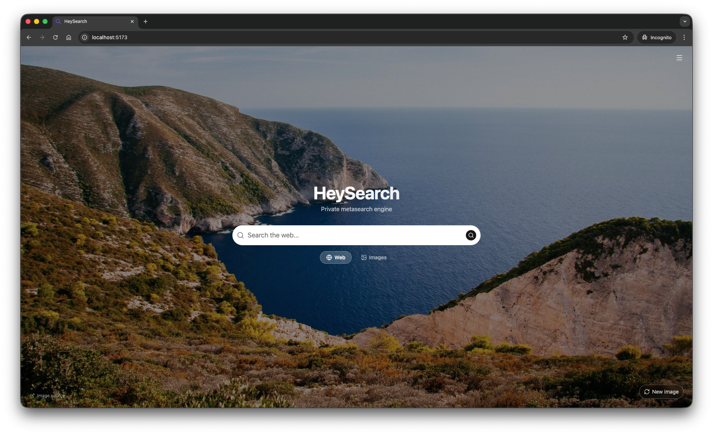
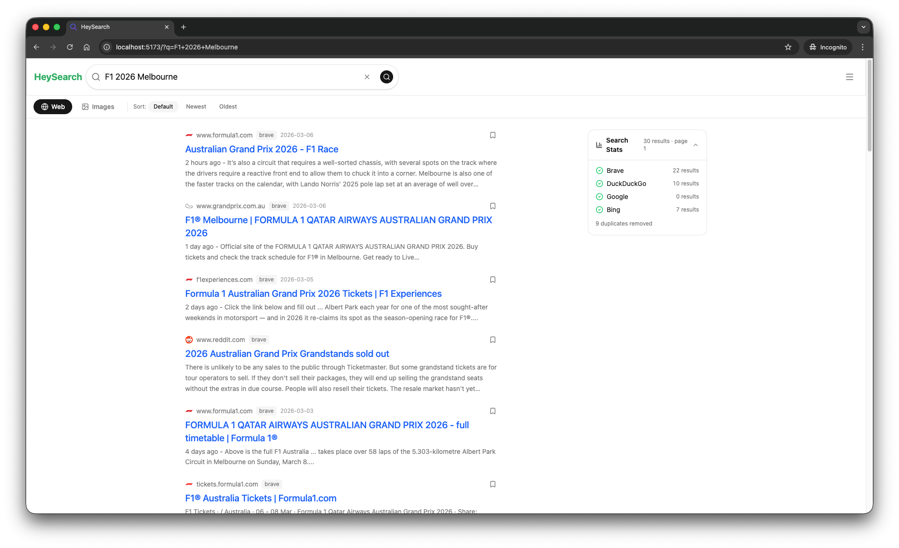

# HeySearch

[](https://www.gnu.org/licenses/agpl-3.0)

A privacy-respecting [metasearch engine](https://en.wikipedia.org/wiki/Metasearch_engine) that aggregates results from multiple search engines.

> Inspired by [SearXNG](https://github.com/searxng/searxng), built for the modern web.

## Screenshots

| Home | Web Search | Image Search |
|------|-----------|--------------|
| [](screenshots/home-page.png) | [](screenshots/text-search.png) | [](screenshots/image-search.png) |

## Why HeySearch over SearXNG?

Both are open-source, self-hosted, privacy-respecting metasearch engines. Here's why HeySearch is the better choice for most people:

| | HeySearch | SearXNG |
|---|---|---|
| **Setup** | `docker compose up -d` — one command, zero config | Requires YAML config, engine tuning, sometimes breaks |
| **UI** | Modern, clean React UI with dark mode, background images, image lightbox | Functional but dated — not mobile friendly |
| **AI agent friendly** | MCP tool server at `/api/mcp` (Claude Desktop, Cursor, Continue), `format=llm` for minimal responses, clean JSON REST API, OpenAPI docs at `/docs` | API exists but less documented; HTML-heavy responses |
| **Bookmarks** | Built-in bookmark manager for results | ❌ |
| **Search history** | Full search history with timestamps, re-run any past query in one click | ❌ |
| **Usage stats** | Built-in analytics dashboard — top queries, click-through rates, engine usage | ❌ |
| **Background gallery** | Beautiful Unsplash/Picsum backgrounds on the home page | ❌ |

**TL;DR** — If you want something you can run in 30 seconds, looks great, works well on your phone, and exposes a clean API for your AI tools, HeySearch is for you. If you need 70+ search engines and deep customisation, SearXNG has the edge.

## Architecture

- **Backend**: Python / FastAPI — async metasearch orchestrator with retry logic
- **Frontend**: React + Vite + TypeScript + Tailwind CSS (shadcn theming) — mobile-first UI
- **Docker**: Multi-stage build (Node frontend build → Python runtime)

## Prerequisites

- [uv](https://docs.astral.sh/uv/) (Python package manager)
- [Node.js](https://nodejs.org/) >= 18
- Python >= 3.12
- [Redis](https://redis.io/) (optional — enables search result caching)

## Running Locally

### 1. Quick start

```bash
# Without Redis (caching disabled)
just dev

# With Redis
REDIS_URL=redis://192.168.1.2:6399 just dev
```

### 2. Docker Compose

The easiest way to run HeySearch with Redis caching in one command:

```bash
docker compose up -d
```

Then open [http://localhost:8000](http://localhost:8000). Data and Redis are persisted in named volumes automatically.

### 3. Docker (standalone)

```bash
# Basic — data stored in anonymous volume
docker run -p 8000:8000 ghcr.io/wahyd4/hey-search

# Recommended — mount data directory for persistence
docker run -p 8000:8000 -v ./hey-search-data:/app/data ghcr.io/wahyd4/hey-search

# With Redis
docker run -p 8000:8000 -v ./hey-search-data:/app/data \
  -e REDIS_URL=redis://your-redis:6379 ghcr.io/wahyd4/hey-search
```

The `/app/data` volume stores the SQLite database (engine settings, excluded domains, cache config). Mount it to preserve your settings across container restarts.

## API Endpoints

| Method     | Path                        | Description                 |
| ---------- | --------------------------- | --------------------------- |
| GET, POST  | `/api/search`               | Search web or images        |
| GET        | `/api/autocomplete?q=`      | Autocomplete suggestions    |
| GET        | `/api/engines`              | List all search engines     |
| PUT        | `/api/engines/{name}`       | Enable/disable an engine    |
| GET        | `/api/settings`             | Get app settings (cache TTL)|
| PUT        | `/api/settings`             | Update settings             |
| DELETE     | `/api/cache`                | Flush search cache          |
| POST       | `/api/mcp`                  | MCP tool server (for LLMs)  |

### Search endpoint parameters

| Parameter    | Default  | Description                                          |
| ------------ | -------- | ---------------------------------------------------- |
| `q`          | required | Search query string                                  |
| `category`   | `web`    | `web` or `images`                                    |
| `page`       | `1`      | Page number (1–50)                                   |
| `pageNumber` | —        | Alias for `page` (takes precedence when provided)    |
| `max_results`| —        | Hard limit on results returned (1–100)               |
| `numResults` | —        | Alias for `max_results`                              |
| `format`     | —        | `llm` for minimal LLM-friendly response (see below)  |
| `imageProxy` | —        | Client image-proxy preference flag (informational)   |
| `safesearch` | —        | Safe search level: `0` off, `1` moderate, `2` strict |
| `engines`    | —        | Comma-separated engine names to restrict (e.g. `google,bing`) |
| `image_size` | —        | `large`, `medium`, or `small` (images only)          |
| `sort`       | `default`| `default`, `date_asc`, or `date_desc`                |
| `date_filter`| —        | `day`, `week`, `month`, or `year`                    |

## Using with AI Agents / LLMs

HeySearch is designed to be used by LLMs and AI agents. There are two integration methods:

### 1. MCP Tool Server (recommended)

[Model Context Protocol](https://modelcontextprotocol.io/) (MCP) is the standard for LLM tool use. Add HeySearch to any MCP-compatible client:

**Claude Desktop** (`~/Library/Application Support/Claude/claude_desktop_config.json`):
```json
{
  "mcpServers": {
    "heysearch": {
      "url": "http://localhost:8000/api/mcp",
      "transport": "http"
    }
  }
}
```

**Cursor / Continue / VS Code Copilot** — add `http://localhost:8000/api/mcp` as an MCP server URL in the tool settings.

**Manual test:**
```bash
# List available tools
curl -X POST http://localhost:8000/api/mcp \
  -H 'Content-Type: application/json' \
  -d '{"jsonrpc":"2.0","id":1,"method":"tools/list","params":{}}'

# Call the search tool
curl -X POST http://localhost:8000/api/mcp \
  -H 'Content-Type: application/json' \
  -d '{"jsonrpc":"2.0","id":2,"method":"tools/call","params":{"name":"search","arguments":{"query":"python async","num_results":3}}}'
```

**Available MCP tools:** `search`, `autocomplete`

### 2. REST API with `format=llm`

For direct API calls from LLM agents, use `format=llm` to get a minimal, token-efficient response:

```bash
# LLM-optimised response — only title, url, snippet, date. No engine noise.
curl "http://localhost:8000/api/search?q=python+async&format=llm&max_results=5" | jq
```

Response shape:
```json
{
  "query": "python async",
  "category": "web",
  "results": [
    { "title": "...", "url": "https://...", "snippet": "...", "date": "2024-01-15" }
  ],
  "total_results": 5
}
```

```bash
# Restrict to specific engines
curl "http://localhost:8000/api/search?q=rust+programming&engines=brave,google&format=llm" | jq

# Image search with size filter
curl "http://localhost:8000/api/search?q=mountain+landscape&category=images&image_size=large" | jq

# Limit results (hard limit, not a hint)
curl "http://localhost:8000/api/search?q=openai&max_results=3&format=llm" | jq
```

> Interactive API docs (Swagger UI) are available at `http://localhost:8000/docs`.

## Features

See [FEATURES.md](FEATURES.md) for the full feature list.

## License

Hey Search is licensed under the [GNU Affero General Public License v3.0](LICENSE) (AGPL-3.0-or-later).

This project was inspired by and incorporates techniques from
[SearXNG](https://github.com/searxng/searxng) (AGPL-3.0). See [NOTICE](NOTICE)
for details on third-party attributions.

> **AGPL-3.0 in plain English:** You can use, modify, and deploy this software
> freely. If you run a modified version as a public network service, you must
> make your modified source code available to your users.
